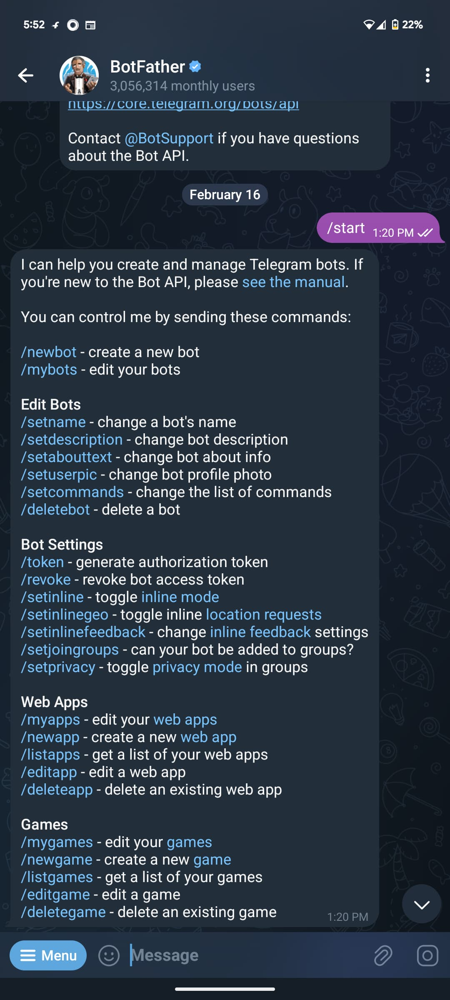

# Remote_pi

##  Small Introduction
**Remote_pi** is a project made in node red platform it is used to operate the raspberry pi via your phone's messaging app called Telegram 

Means your phone's messaging app is your pi terminal, you can list the directory, run any script, write the notes using echo command etc

## Hardware and software Component

### **1. Raspberry pi - Hardware** 
>Any version of PI user can use that is having ethernet or Wifi functionality 

>User can also use any other linux machine rather than raspberrey pi but in this project we took Raspberrey PI 5 for reference. 

### **2. Node-RED platform - Software tool**
 >Refer this [link](https://nodered.org/docs/getting-started/raspberrypi) for installing Node-red software in your PI.

### **3. PC/Laptop for Opening Node-RED client and for configering the nodes**
 ## Creating Telegrambot 

 ###  **1. Open Telegram app in your phone**
 
 ### **2. Search "BotFather" and go into that chat**
 
### **3. Write "/start" command in chat, it will give you list of commands that this bot support**

  

 ### **4. After this write "/newbot" for creating your new bot**

  

### **5. Name your bot that should display in telegram list**

 

 ### **6. Now you has to create the username as stated in the message** 

 

 >### Copy the HTTP API token and paste it somewhere, this token is used by node-red in coming steps 

 ## Steps to enable RemotePI using Node-RED

### 1. Hopefully you installed Node-RED in your PI machine by following the steps mention in this [link](https://nodered.org/docs/getting-started/raspberrypi)
### 2. Open PI terminal and type below command to run Node-RED software

    node-red-pi --max-old-space-size=256
    

### 3. Do `ifconfig` in another terminal and get an IP of your PI 
### 4. Open any web Browser in your PC/Laptop (where your laptop and PI is connected to same network) and paste the http://ip:1880  (take the ip from the pervious steps using `ifconfig`), after entering you will see window like below

   

### 5. Install the Telegram chatbot node by following below steps
    Go to the menu by clicking three line button --> Manage pallette

   
    
    Then in Manage Pallette click on Install tab --> search 'Telegram bot' in search bar --> click install button (In image it is showing installed because I already installed)

   

### 6. Go to the menu again by clicking on three lines button and then click on the import flow to import the .json file (you can find .json file in the repo itself called as **RemotePI.json**)

   
   
    Click on 'select the file to import' and add the .json file from your PC, after that click on import button 

### 7. After this, flow is visisble on Node-RED platform as below

### 8. Open Telegram node (any revicer or sender) by double clicking on the node --> go to the edit --> add your telegram token and bot name that we generated in pervious section, then click update and Done to save it 

  
  

### 9. Now compile and run it using deploy button at the rightmost corner

### ***Now the configeration is done, Good Job!!!***

## Demo

### 1. Open your telegram app in phone 
### 2. Go to the chatbot that you created 
### 3. Type any Linux command like `ls`, `mkdir`, `cat filename`, etc and you will get the response like a terminal output
### Here is one of the example :

## Some of the Use cases

### 1. if you find any new project/git repo while scrolling, clone it from the phone itself and later on explore it from the laptop
### 2. if you forget the IP of your machine, do `ifconfig` and get the machine's IP via phone
### 3. Check who all are using the machine remotely via phone using `w` command
### 4. if you forget to commit your code, you can do it via phone  

>### Rather than above usecases, you can make your own usecase for this Remote_PI  

